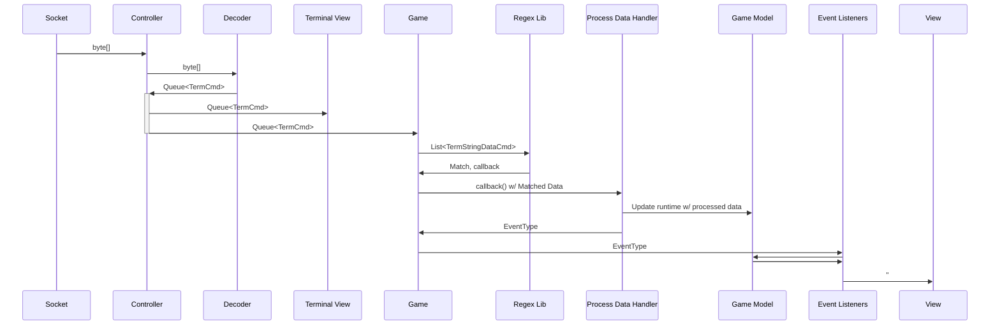

All of this code represents the Session Window and various views to represent in game data

```mermaid
sequenceDiagram
    Socket->>Controller:byte[]
    Controller->>Decoder:byte[]
    Decoder->>+Controller:Queue<TermCmd>
    Controller->>Terminal View:Queue<TermCmd>
    Controller->>-Game:Queue<TermCmd>
    Game->>Regex Lib:List<TermStringDataCmd>
    Regex Lib->>Game:Match, callback
    Game->>Process Data Handler:callback() w/ Matched Data
    Process Data Handler->>Game Model:Update runtime w/ processed data
    Process Data Handler->>Game:EventType
    Game->>Event Listeners:EventType
    Event Listeners->>Game Model: 
    Game Model->>Event Listeners: 
    Event Listeners->>View: "  
```