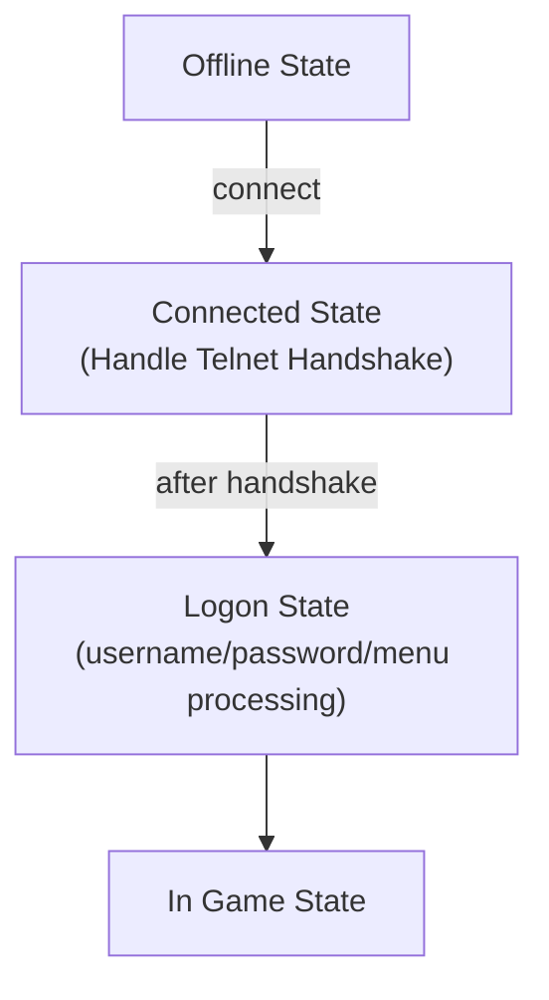

Session States handle the offline <--> InGame process

```mermaid
flowchart TD;
    O[Offline State] --connect-->C["Connected State\n(Handle Telnet Handshake)"];
    C--after handshake -->L["Logon State\n(username/password/menu processing)"];
    L-->I[In Game State];
```
